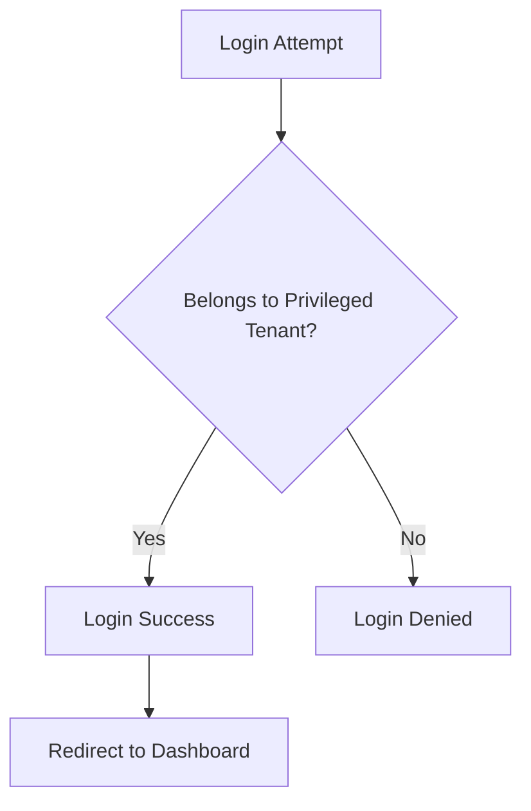

# Frontend Service (BFF)

Frontend service for ws-demo-poly1 project.

## Overview

This service serves as a Backend For Frontend (BFF) that integrates various backend service functionalities and provides users with a single web interface.

### Key Responsibilities

- Provide unified UI
- Aggregate requests to backend services
- Session management
- Client-side authentication state management

## Access Control

**IMPORTANT**: Only users belonging to **privileged tenants** can log in to this application.



## Documentation

### Service Documentation
- [Service Specification](./docs/services/frontend/spec.md) - Complete service specification including user scenarios, UI flows, and integration patterns

### Architecture Documentation
- [API Guidelines](./docs/architecture/api-guidelines.md) - REST API design standards
- [Authentication Flow](./docs/architecture/authentication-flow.md) - JWT-based authentication and authorization
- [Database Design](./docs/architecture/database-design.md) - Cosmos DB container design and partition strategy

## Features

- User authentication and authorization
- Dashboard with role-based views
- Tenant management UI
- User management UI
- Service assignment UI
- Responsive design
- Next.js with React
- Server-side rendering (SSR)
- Client-side routing

## Tech Stack

- **Framework**: Next.js 14+
- **UI Library**: React 18+
- **Styling**: TailwindCSS / CSS Modules
- **State Management**: React Context / Redux (TBD)
- **HTTP Client**: Axios / Fetch API
- **Authentication**: JWT tokens

## Setup

### Prerequisites

- Node.js 18+
- npm or yarn
- Access to backend services (Auth, User Management, Service Setting)

### Installation

```bash
# Install dependencies
npm install

# Or using yarn
yarn install
```

### Configuration

Create `.env.local` file with the following environment variables:

```bash
# Backend API endpoints
NEXT_PUBLIC_AUTH_SERVICE_URL=http://localhost:8001
NEXT_PUBLIC_USER_MANAGEMENT_SERVICE_URL=http://localhost:8002
NEXT_PUBLIC_SERVICE_SETTING_SERVICE_URL=http://localhost:8004

# App configuration
NEXT_PUBLIC_APP_NAME=Management Application
NEXT_PUBLIC_APP_VERSION=1.0.0
```

## Running the Service

### Development Mode

```bash
# Start development server
npm run dev

# Or using yarn
yarn dev
```

The application will be available at `http://localhost:3000`

### Production Mode

```bash
# Build for production
npm run build

# Start production server
npm start
```

## Project Structure

```
src/front/
├── app/                    # Next.js app directory
│   ├── (auth)/            # Authentication routes
│   │   ├── login/         # Login page
│   │   └── logout/        # Logout handler
│   ├── dashboard/         # Dashboard page
│   ├── tenants/           # Tenant management pages
│   ├── users/             # User management pages
│   └── services/          # Service setting pages
├── components/            # Reusable React components
│   ├── common/           # Common UI components
│   ├── layouts/          # Layout components
│   └── features/         # Feature-specific components
├── lib/                  # Utility functions and API clients
│   ├── api/             # API client functions
│   ├── auth/            # Authentication utilities
│   └── utils/           # Helper functions
├── public/              # Static assets
└── styles/              # Global styles
```

## Main User Scenarios

### US-1: Login
Users belonging to privileged tenants can log in with their ID/password to access the management interface.

### US-2: Dashboard Display
After login, displays a dashboard with menu options based on the user's role.

### US-3: Tenant Management
Administrators can view, create, edit, and delete tenants (except privileged tenants).

### US-4: User Management
Administrators can manage users within tenants, including adding and removing users.

### US-5: Service Assignment
System administrators can assign services to tenants and manage service availability.

## API Integration

This frontend communicates with the following backend services:

### Auth Service (Port 8001)
- `POST /api/auth/login` - User login
- `POST /api/auth/verify` - Token verification
- `POST /api/auth/refresh` - Token refresh

### User Management Service (Port 8002)
- `GET /api/tenants` - List tenants
- `POST /api/tenants` - Create tenant
- `GET /api/tenants/{tenantId}/users` - List tenant users
- `POST /api/tenants/{tenantId}/users` - Add user to tenant

### Service Setting Service (Port 8004)
- `GET /api/services` - List available services
- `GET /api/tenants/{tenantId}/services` - Get tenant services
- `POST /api/tenants/{tenantId}/services` - Assign service to tenant

## Development

### Running Tests

```bash
# Run unit tests
npm test

# Run e2e tests
npm run test:e2e

# Run with coverage
npm run test:coverage
```

### Linting and Formatting

```bash
# Run ESLint
npm run lint

# Fix linting issues
npm run lint:fix

# Format code with Prettier
npm run format
```

## Building for Production

```bash
# Create optimized production build
npm run build

# Analyze bundle size
npm run analyze
```

## Environment Variables

| Variable | Description | Default |
|----------|-------------|---------|
| `NEXT_PUBLIC_AUTH_SERVICE_URL` | Auth service endpoint | http://localhost:8001 |
| `NEXT_PUBLIC_USER_MANAGEMENT_SERVICE_URL` | User management service endpoint | http://localhost:8002 |
| `NEXT_PUBLIC_SERVICE_SETTING_SERVICE_URL` | Service setting service endpoint | http://localhost:8004 |
| `NEXT_PUBLIC_APP_NAME` | Application name | Management Application |

## Related Services

- **Auth Service** (ws-demo-poly3) - Provides authentication and authorization
- **User Management Service** (ws-demo-poly2) - Manages tenants and tenant users
- **Service Setting Service** (ws-demo-poly4) - Manages service assignments to tenants

## License

This project is part of the ws-demo-poly workspace.
