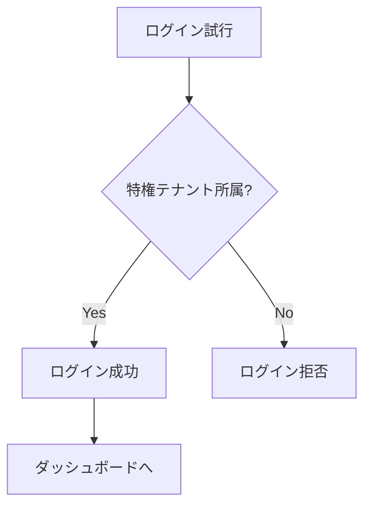
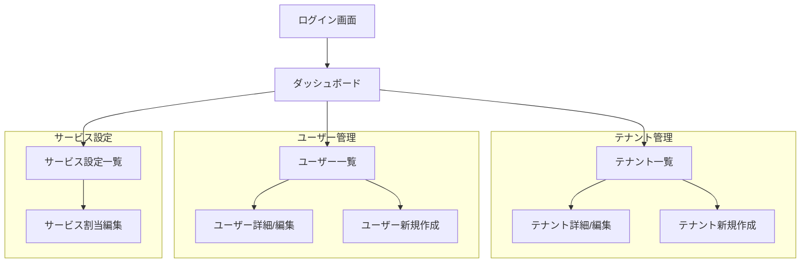

# Frontend サービス仕様書

**サービス名**: Frontend (BFF)  
**リポジトリ**: ws-demo-poly1  
**技術スタック**: Next.js (React)  
**最終更新**: 2026-01-24  
**ステータス**: Draft

## 概要

各バックエンドサービスの機能を統合し、ユーザーに単一のWebインターフェースを提供するBFF (Backend For Frontend) サービスです。

### 主要な責務

- 統一されたUIの提供
- バックエンドサービスへのリクエスト集約
- セッション管理
- クライアントサイドの認証状態管理

## アクセス制御

**重要**: 本アプリケーションへのログインは**特権テナントに所属するユーザーのみ**が可能です。

## ユーザーシナリオ

### US-1: ログイン (Priority: P1) 🎯 MVP

特権テナントに所属するユーザーとして、ID/パスワードでログインし、管理画面にアクセスできる。

**受入条件**:
1. **Given** ログイン画面が表示されている, **When** 正しいID/パスワードを入力して送信する, **Then** ダッシュボードにリダイレクトされる
2. **Given** ログイン画面が表示されている, **When** 誤ったID/パスワードを入力して送信する, **Then** エラーメッセージが表示される
3. **Given** ログイン画面が表示されている, **When** 特権テナント以外のユーザーでログインを試みる, **Then** アクセス拒否メッセージが表示される

### US-2: ダッシュボード表示 (Priority: P1) 🎯 MVP

ログイン後、ユーザーのロールに応じたダッシュボードを表示する。

**受入条件**:
1. **Given** ユーザーがログインしている, **When** ダッシュボードにアクセスする, **Then** ユーザーのロールに応じたメニューが表示される
2. **Given** 閲覧者ロールのユーザー, **When** ダッシュボードを表示する, **Then** 編集・作成ボタンは非表示となる

### US-3: テナント管理画面 (Priority: P2)

テナント一覧の表示、テナント詳細の参照・編集を行う。

**受入条件**:
1. **Given** 管理者ロールのユーザー, **When** テナント一覧画面を開く, **Then** 全テナントの一覧が表示される
2. **Given** テナント一覧画面, **When** テナント行をクリックする, **Then** テナント詳細画面に遷移する

### US-4: ユーザー管理画面 (Priority: P2)

ユーザー一覧の表示、ユーザー詳細の参照・編集を行う。

### US-5: サービス設定画面 (Priority: P3)

テナントに対するサービス割当を管理する。

## 画面構成

## 機能要件

### FR-001: 認証

- システムは ID/パスワードによるログイン機能を提供しなければならない
- システムは認証認可サービスから返却されたJWTをセキュアに保持しなければならない
- システムはJWTの有効期限を監視し、期限切れ時にログアウト処理を行わなければならない

### FR-002: 認可

- システムはユーザーのロールに基づいて表示するメニュー・機能を制御しなければならない
- システムは権限のない操作に対してはUIレベルで非表示/非活性化しなければならない

### FR-003: BFF機能

- システムはバックエンドサービスへのリクエストを集約・中継しなければならない
- システムは各バックエンドサービスへのリクエストにJWTを付与しなければならない
- システムはバックエンドサービスからのエラーを適切にハンドリングしなければならない

### FR-004: UI/UX

- システムはレスポンシブデザインを提供しなければならない
- システムは操作結果をフィードバック（成功/失敗メッセージ）で通知しなければならない
- システムはローディング状態を視覚的に表示しなければならない

## 非機能要件

### NFR-001: パフォーマンス

- 画面の初期表示は3秒以内に完了すること
- API呼び出しのタイムアウトは30秒とする

### NFR-002: セキュリティ

- JWTはHttpOnly Cookieまたは安全なストレージに保存すること
- XSS対策を実施すること
- CSRF対策を実施すること

### NFR-003: 可用性

- エラー発生時は適切なエラーページを表示すること
- ネットワークエラー時はリトライを促すメッセージを表示すること

## API連携

Frontend は以下のバックエンドサービスと連携します。

| サービス | 用途 | エンドポイント例 |
|---------|------|-----------------|
| 認証認可サービス | ログイン、JWT検証 | `/api/auth/*` |
| テナント管理サービス | テナント・ユーザー管理 | `/api/tenants/*`, `/api/users/*` |
| 利用サービス設定サービス | サービス割当管理 | `/api/service-settings/*` |

## 成功基準

- **SC-001**: ユーザーは30秒以内にログインからダッシュボード表示まで完了できる
- **SC-002**: 95%のAPI呼び出しが5秒以内にレスポンスを返す
- **SC-003**: ロールに基づく画面表示切替が100%正確に動作する
